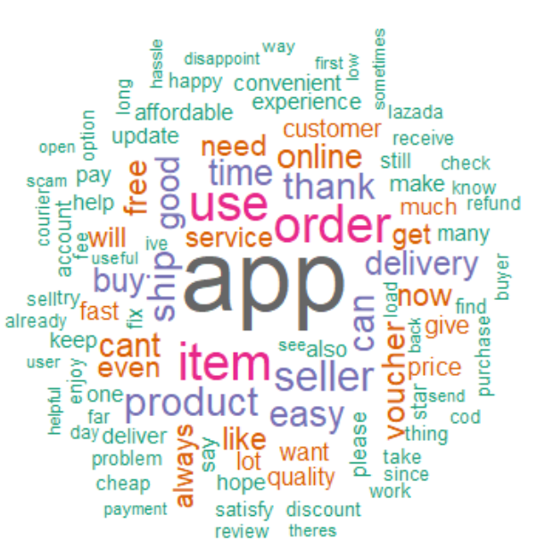
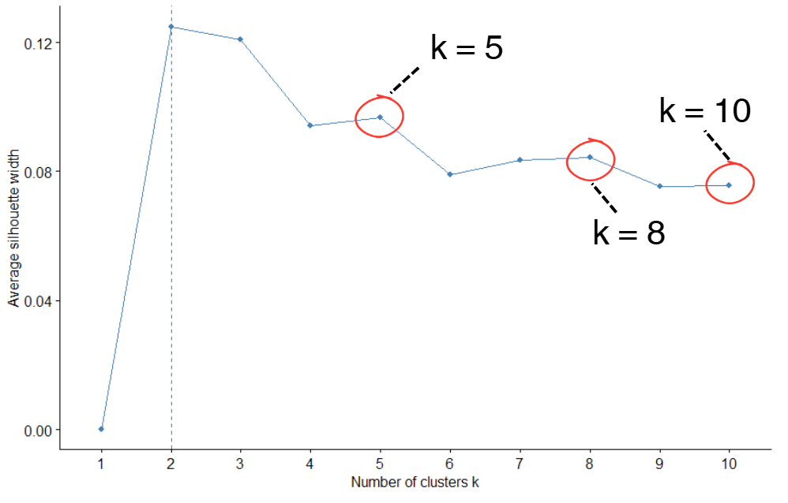
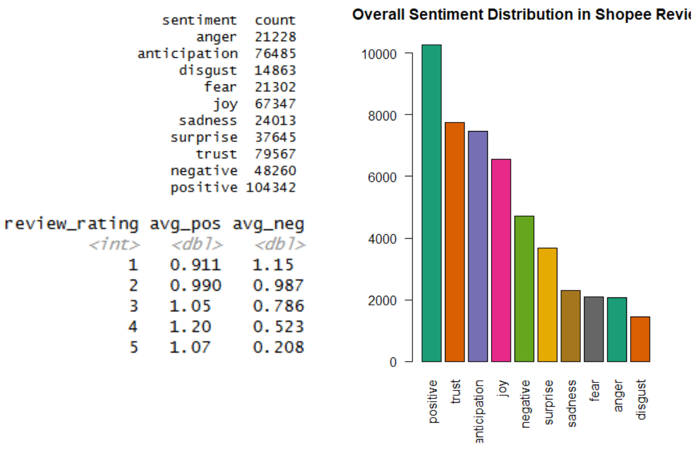
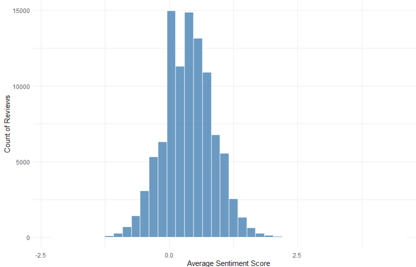
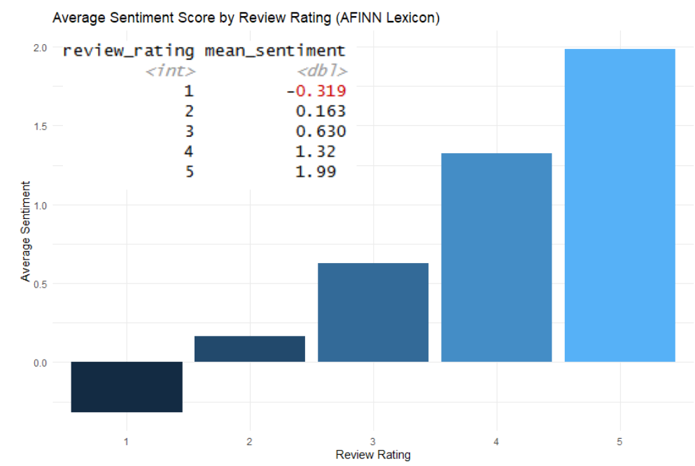
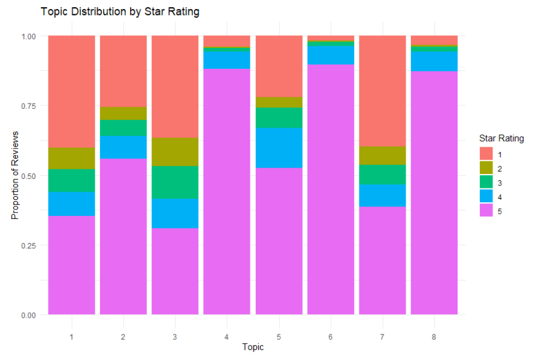

**Project Status:** Completed (Dec 2025)

# 🛒 Shopee App Customer Sentiment Analysis

### Project Background
In the highly competitive e-commerce market, customer experience is the primary driver of success. Shopee receives thousands of app reviews daily, making manual analysis impossible.

This project utilises **Natural Language Processing (NLP)** and **Unsupervised Machine Learning** to transform unstructured text data into actionable business strategies. Using the **CRISP-DM framework**, I analysed over 700,000 user reviews to identify key pain points and drivers of satisfaction.

### Business Objectives
* **Goal:** Identify the top 3 drivers of positive and negative user experience.
* **Target:** Provide data-backed recommendations to reduce negative reviews by 15% and increase average app store ratings from 4.3 to 4.5 stars.

---

### Technical Implementation

#### 1. Data Cleaning & Preprocessing (R)
Handling "noisy" user-generated content required rigorous cleaning:
* **Language Filtering:** Used `cld3` to isolate English reviews and remove non-English characters.
* **Slang Removal:** Engineered custom Regex filters to remove Singlish and Tagalog particles (e.g., "lah", "mah", "po", "naman") to improve model accuracy.
* **Normalisation:** Applied Lemmatisation (`textstem`) rather than Stemming to preserve semantic meaning (e.g., keeping "delivery" instead of "deliveri").

*Figure: Word cloud visualisation of the most frequent terms after stopword removal.*

#### 2. Topic Modelling (LDA)
I implemented **Latent Dirichlet Allocation (LDA)** to discover hidden themes in the reviews.
* **Algorithm Selection:** Tested both **VEM** and **Gibbs Sampling**. The Gibbs algorithm proved superior in creating distinct, non-overlapping topics.
* **Optimising k (Number of Topics):** Used Perplexity Scores and Silhouette Analysis (Elbow Method) to determine that **k=8** was the optimal number of topics for interpretability.

*Figure: Elbow plot of Silhouette scores determining k=8 as the optimal balance for interpretability.*

#### 3. Sentiment Analysis
Comparative analysis of three lexicon-based models:
* **Syuzhet (NRC):** Good for emotional nuance (joy, anger) but computationally expensive.

*Figure: Output of Syuzhet's sentiment analysis model.*

* **Sentimentr:** Efficient but struggled with accuracy on 1-star reviews.

*Figure: Output of Sentimentr's sentiment analysis model.*

* **Tidytext (AFINN):** **Selected Model.** Demonstrated the highest correlation with actual star ratings and effectively captured valence shifters.

*Figure: Output of Tidytext's sentiment analysis model.*

---

### Key Insights & Visualisations

#### Insight 1: The "Problem Areas" are Specific
The LDA model successfully clustered complaints into interpretable topics. The analysis revealed that **Topic 1 (Payment & Account Issues)** and **Topic 7 (Delivery Failures)** are the primary drivers of 1-star reviews.

*Figure: Stacked bar chart showing that Payment Issues (Topic 1) dominate the negative reviews.*

#### Insight 2: The "Convenience" Advantage
Positive reviews were heavily concentrated in **Topic 8 (Convenience Value)**, validating that Shopee's competitive advantage lies in its ease of use for remote shopping.

---

### Business Recommendations
Based on the analysis, the following strategic actions are recommended:
1.  **Prioritise Payment Gateway Stability:** Since "Payment Issues" correlate most strongly with churn (1-star ratings), resources should be shifted from UI updates to backend stability.
2.  **Courier Accountability:** "Delivery Failures" are a major pain point. Stricter SLAs for logistics partners could reduce negative sentiment significantly.
3.  **Automated Triage:** Deploy the trained LDA model to automatically flag incoming reviews about "Scams" or "Refunds" for immediate human intervention.

### Repository Structure
* `Scripts/`: 
  * `1_topic_modelling_lda.R`: Full pipeline for preprocessing and Gibbs Sampling LDA.
  * `2_sentiment_analysis.R`: Comparative sentiment analysis scripts.
* `Data/`: Contains the processed datasets and custom stopword lists (Singlish/Domain-specific).

---
*Created by Wong Jung Yong*
